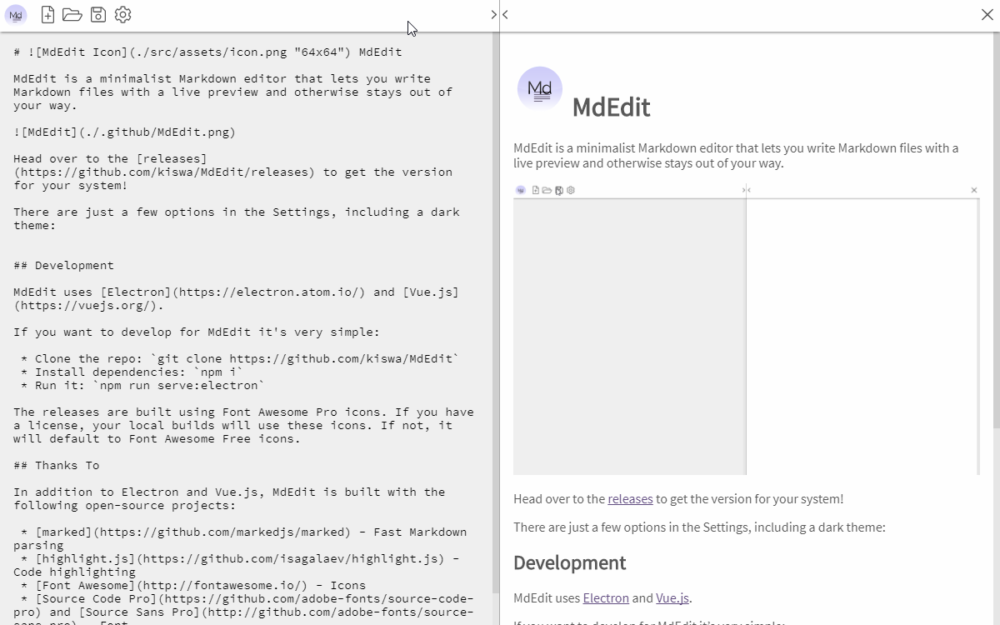
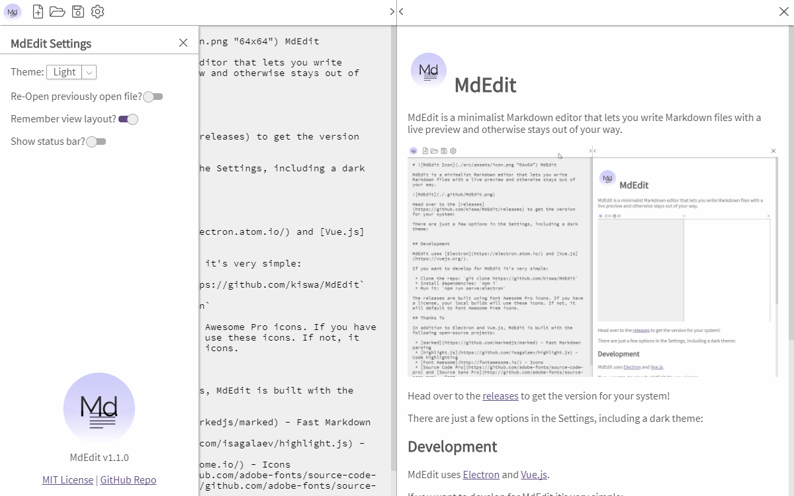

#  MdEdit

MdEdit is a minimalist Markdown editor that lets you write Markdown files with a live preview and otherwise stays out of your way.

MdEdit supports relative image paths, as well as defining image size via the title. See [Features](#features) for more details.

Head over to the [releases](https://github.com/kiswa/MdEdit/releases) to get the version for your system!

## Features

 * Relative image paths
 * Synchronized scrolling between editor and preview
 * Standard keyboard shortcuts (substitute <kbd>Cmd</kbd> for <kbd>Ctrl</kbd> on Mac)
  * <kbd>Ctrl</kbd>+<kbd>s</kbd> to save
  * <kbd>Ctrl</kbd>+<kbd>n</kbd> for new file
  * <kbd>Ctrl</kbd>+<kbd>o</kbd> to open a file
 * Image size setting in title
  * *e.g.* ``
  * If not set, the image will be limited to 100% width
 * Checklists
  * Just like GitHub ` - [ ] ToDo` is unchecked, and ` - [x]  Done` is checked
  * Visual only - not interactive

## Settings

There are just a few options in the Settings. The status bar shows the path to the current file, and whether there are unsaved changes.

Including a dark theme.

## Development

MdEdit uses [Electron](https://electron.atom.io/) and [Vue.js](https://vuejs.org/).

If you want to develop for MdEdit it's very simple:

 * Clone the repo: `git clone https://github.com/kiswa/MdEdit`
 * Install dependencies: `npm i`
 * Run it: `npm run serve`

**NB:** The releases are built using Font Awesome Pro icons. If you have a license - and have npm set up for it - your local builds will use these icons. If not, it will default to Font Awesome Free icons (which will look different from the screenshots above).

## Thanks To:

In addition to Electron and Vue.js, MdEdit is built with the following open-source projects:

 * [marked](https://github.com/markedjs/marked) - Fast Markdown parsing
 * [highlight.js](https://github.com/isagalaev/highlight.js) - Code highlighting
 * [Font Awesome](http://fontawesome.io/) - Icons
 * [Source Code Pro](https://github.com/adobe-fonts/source-code-pro) and [Source Sans Pro](http://github.com/adobe-fonts/source-sans-pro) - Fonts
